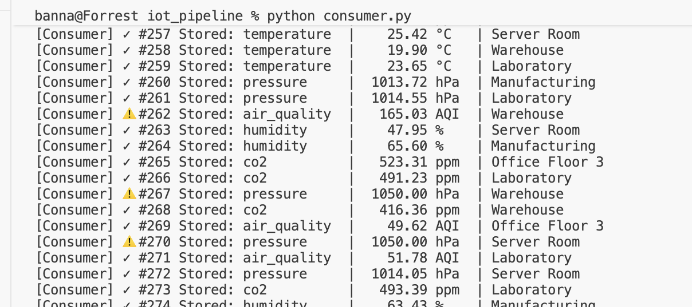
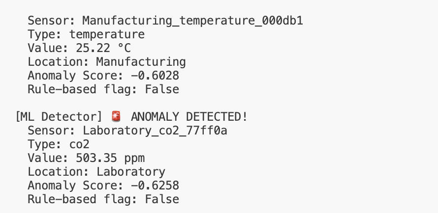
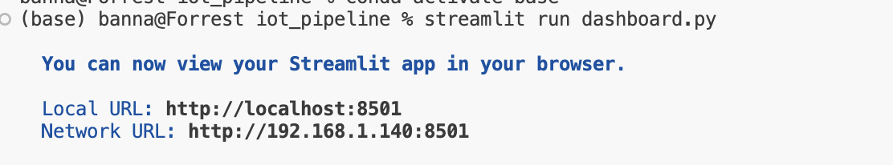
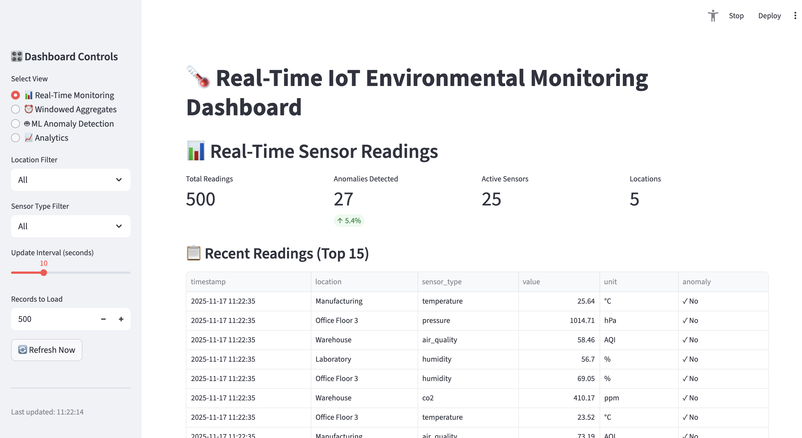
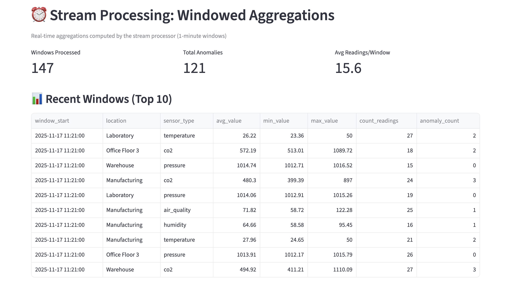
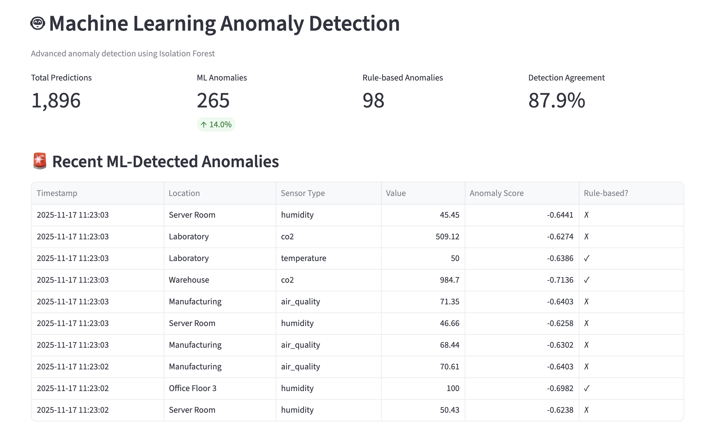
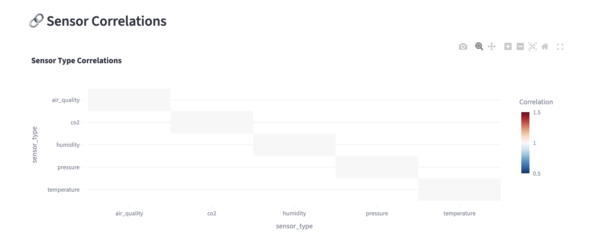
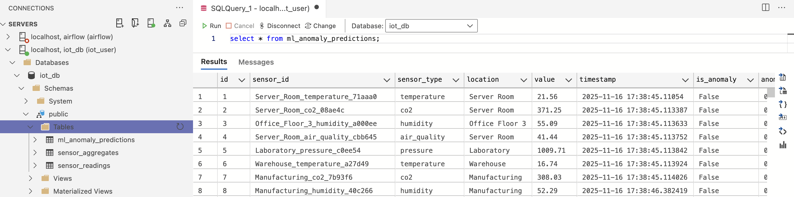

This system demonstrates a complete real-time data pipeline for environmental monitoring across multiple locations. 

It processes sensor data streams through Apache Kafka, performs windowed aggregations, applies machine learning for anomaly detection, and visualizes everything in an interactive dashboard.

### Features

**Real-time Data Streaming**: Apache Kafka message broker with producer-consumer architecture  
**Stream Processing**: Windowed aggregations (1-minute tumbling windows)  
**ML Anomaly Detection**: Isolation Forest for unsupervised anomaly detection with online learning  
**Live Dashboard**: Interactive Streamlit dashboard with real-time updates  
**Multi-sensor Monitoring**: Temperature, humidity, air quality, pressure, CO2 sensors  
**Multiple Locations**: Server rooms, offices, warehouses, laboratories, manufacturing floors  
**Production-Ready**: Containerized with Docker, comprehensive error handling, database indexing

---

## System Architecture

```
┌─────────────────┐
│  IoT Sensors    │  (Python Producer)
│  - Temperature  │
│  - Humidity     │
│  - Air Quality  │
│  - Pressure     │
│  - CO2          │
└────────┬────────┘
         │
         ▼
┌─────────────────┐
│  Apache Kafka   │  (Message Broker)
│  Topic:         │
│  iot_sensors    │
└────┬───────┬────┘
     │       │
     │       └──────────────────┐
     │                          │
     ▼                          ▼
┌────────────┐        ┌─────────────────┐
│  Consumer  │        │ Stream Processor │
│            │        │ (Flink-style)    │
│  Raw Data  │        │ - 1-min windows  │
│  Storage   │        │ - Aggregations   │
└─────┬──────┘        └────────┬─────────┘
      │                        │
      ▼                        ▼
┌──────────────────────────────────┐
│       PostgreSQL Database        │
│  - sensor_readings              │
│  - sensor_aggregates            │
│  - ml_anomaly_predictions       │
└────────────┬─────────────────────┘
             │
             ▼
    ┌────────────────┐
    │ ML Detector    │
    │ (Isolation     │
    │  Forest)       │
    └────────┬───────┘
             │
             ▼
    ┌────────────────┐
    │   Streamlit    │
    │   Dashboard    │
    │   (Live UI)    │
    └────────────────┘
```

---

## Setup

### Installation

1. **Clone or download the project, CD into the IOT Folder**
```bash
cd iot-pipeline
```

2. **Start the infrastructure** (Kafka + PostgreSQL)
```bash
docker-compose up -d
```

Wait ~30 seconds for services to be ready. Verify with:
```bash
docker-compose ps
```

3. **Install Python dependencies**
```bash
pip install -r requirements.txt
```

4. **Run the system components** (in separate terminals)

**Terminal 1 - Producer** (generates sensor data):
```bash
python producer.py
```


**Terminal 2 - Consumer** (stores raw data):
```bash
python consumer.py
```



**Terminal 3 - Stream Processor** (windowed aggregations):
```bash
python stream_processor.py
```


**Terminal 4 - ML Detector** (anomaly detection):
```bash
python ml_detector.py
```



**Terminal 5 - Dashboard** (visualization):
```bash
streamlit run dashboard.py
```



5. **Access the dashboard**
- Open browser to: http://localhost:8501
- Dashboard auto-refreshes every 10 seconds

---

## Dashboard Walkthrough

### 1. Real-Time Monitoring Tab
- Live sensor readings from all locations
- KPIs: Total readings, anomalies, active sensors
- Time series visualization
- Anomaly distribution by type and location



### 2. Windowed Aggregates Tab
- Stream processing results (1-minute windows)
- Average, min, max values per window
- Statistical trends over time
- Anomaly counts per window



### 3. ML Anomaly Detection Tab
- Machine learning predictions
- Comparison: ML vs rule-based detection
- Anomaly score distributions
- Detection method agreement metrics



### 4. Analytics Tab
- Sensor correlation heatmaps
- Statistics by location
- Advanced analytics and insights



---

## Additional Features

### Stream Processing

**Implementation**: `stream_processor.py`

**Features**:
- **1-minute tumbling windows**: Continuous non-overlapping time windows
- **Real-time aggregations**: Computes avg, min, max, stddev for each sensor type/location
- **Statistical anomaly detection**: Z-score based detection (3-sigma threshold)
- **Multi-sensor correlation**: Tracks patterns across different sensor types
- **Low-latency processing**: Sub-second processing with efficient windowing

### Machine Learning

**Implementation**: `ml_detector.py`

**Features**:
- **Isolation Forest**: Unsupervised anomaly detection algorithm
- **Online learning**: Models retrain every 5 minutes with new data
- **Feature engineering**: Multi-dimensional features including:
  - Current sensor value
  - Time-based cyclical encoding (hour of day)
  - Rate of change from previous reading
  - Rolling statistics (mean, std, range)
- **Sequential pattern analysis**: Maintains 100-reading history per sensor
- **Dual detection**: Compares ML predictions with rule-based anomalies

---

## Database Schema

To access the database (with a client like DBeaver), follow these steps:

#### Connection Parameters
- **Host**: `localhost`
- **Port**: `5432`
- **Database**: `iot_db`
- **Username**: `iot_user`
- **Password**: `iot_password`

#### Setup Instructions
1. Open your database client
2. Create a new PostgreSQL connection
3. Enter the connection parameters above
4. Connect and browse tables



### Database Schema
- **ml_anomaly_predictions**: Stores ML model predictions and anomaly scores
- **sensor_readings**: Raw sensor data from IoT devices
- **flink_processed**: Stream-processed data from Apache Flink

### `sensor_readings`
Raw sensor data from Kafka consumer.

| Column | Type | Description |
|--------|------|-------------|
| id | SERIAL | Primary key |
| sensor_id | VARCHAR(100) | Unique sensor identifier |
| sensor_type | VARCHAR(50) | Type: temperature, humidity, etc. |
| location | VARCHAR(100) | Physical location |
| value | NUMERIC(10,2) | Sensor reading value |
| timestamp | TIMESTAMP | Reading timestamp |
| anomaly | BOOLEAN | Rule-based anomaly flag |
| unit | VARCHAR(20) | Measurement unit |

### `sensor_aggregates`
Windowed aggregations from stream processor.

| Column | Type | Description |
|--------|------|-------------|
| window_start | TIMESTAMP | Window start time |
| window_end | TIMESTAMP | Window end time |
| location | VARCHAR(100) | Location grouping |
| sensor_type | VARCHAR(50) | Sensor type grouping |
| avg_value | NUMERIC(10,2) | Average value in window |
| min_value | NUMERIC(10,2) | Minimum value |
| max_value | NUMERIC(10,2) | Maximum value |
| stddev_value | NUMERIC(10,2) | Standard deviation |
| count_readings | INTEGER | Number of readings |
| anomaly_count | INTEGER | Anomalies detected |

### `ml_anomaly_predictions`
ML model predictions and scores.

| Column | Type | Description |
|--------|------|-------------|
| sensor_id | VARCHAR(100) | Sensor identifier |
| sensor_type | VARCHAR(50) | Sensor type |
| value | NUMERIC(10,2) | Reading value |
| timestamp | TIMESTAMP | Reading time |
| is_anomaly | BOOLEAN | ML prediction |
| anomaly_score | NUMERIC(10,6) | Isolation Forest score |
| rule_based_anomaly | BOOLEAN | Original rule flag |

---
